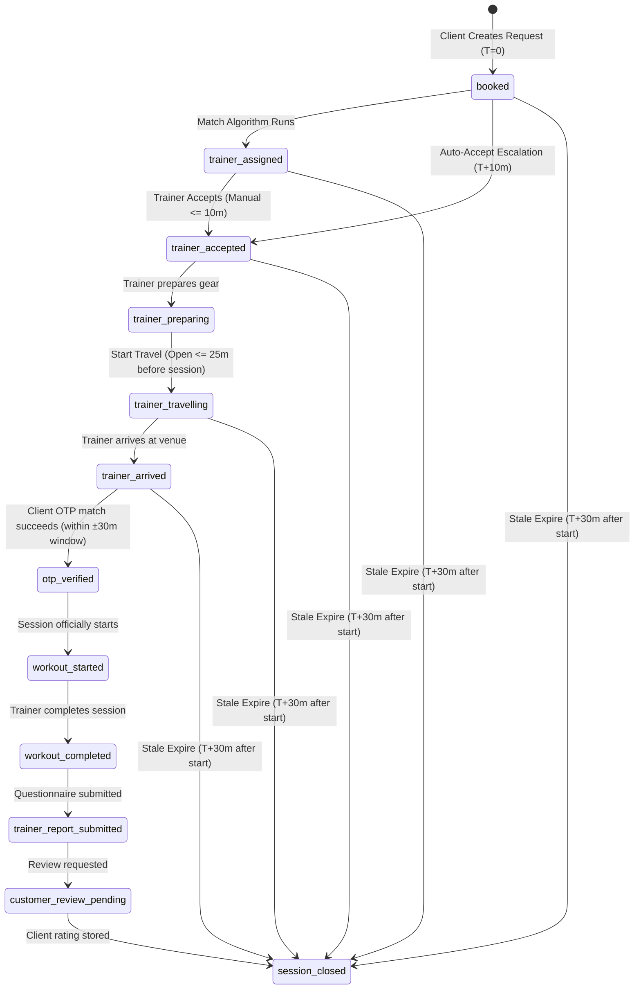
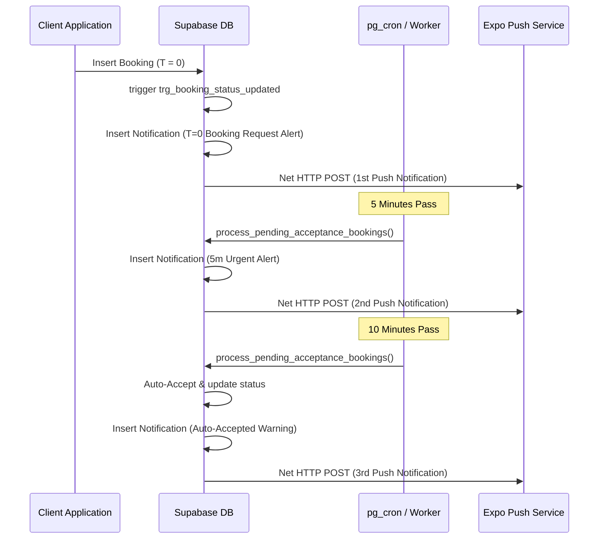

# VIRLA ONE BRAIN: PHASE 1 READ-ONLY FORENSIC ARCHITECTURE AUDIT

This document establishes a complete forensic analysis of the current Virla database, backend business logic, timing models, frontend state caching, and security models. It identifies conflicts and details the proposed event-driven "Single Brain" timezone-safe architecture design.

---

## 1. CURRENT ARCHITECTURE OVERVIEW

The current Virla application runs on a hybrid client-server model:
*   **Database (Supabase)**: Authoritative storage using Postgres. PostgreSQL client tables enable Row Level Security (RLS) but have permissive policies (`USING (true) WITH CHECK (true)`) to facilitate direct client insertion/modification.
*   **Backend & Edge Functions**: Privileged operations (like atomic signup transactions and trainer application approvals) are executed via Edge Functions or Database stored procedures (RPC) configured with `SECURITY DEFINER` to override RLS.
*   **Client State Caching (Zustand + AsyncStorage/SecureStore)**: Client state is read into memory-level Zustand stores (e.g., `useBookingStore`, `useUserStore`) which are persisted locally on devices. Local edits are made directly on these caches and synchronized to the database asynchronously, creating duplication of truth.

---

## 2. DATABASE FORENSIC MAP

### 2.1 Table Schema & Integrity Constraints

| Table Name | Primary Key | Foreign Keys & References | Unique Indexes | Constraints & Enums |
| :--- | :--- | :--- | :--- | :--- |
| `public.users` | `id` (TEXT) | None | `phone` (Unique) | `role` CHECK IN (`customer`, `trainer`, `admin`) <br> `status` CHECK IN (`active`, `suspended`) |
| `public.user_profiles` | `id` (TEXT) | `user_id` (TEXT) References `users(id)` ON DELETE CASCADE | `user_id` (Unique) | None |
| `public.trainers` | `id` (TEXT) | `id` (TEXT) References `users(id)` | `name` (Unique) | `level` CHECK IN (`Associate`, `Certified`, `Elite`) |
| `public.workouts` | `id` (TEXT) | None | None | None |
| `public.bookings` | `id` (TEXT) | `client_id` REFERENCES `users(id)` <br> `trainer_id` (TEXT) | `unique_active_trainer_slot` ON (`trainer_id`, `date`, `time`) WHERE `status != 'cancelled'` | Timeline Status CHECK constraint handles state transitions. |
| `public.slot_reservations` | `id` (TEXT) | None | `unique_trainer_slot_reservation` ON (`trainer_id`, `slot_date`, `slot_time`) | Temporary reservation expires via `expires_at` (unix timestamp epoch ms) |
| `public.notifications` | `id` (TEXT) | `user_id` REFERENCES `users(id)` | None | None |
| `public.chat_messages` | `id` (TEXT) | None | None | `sender` CHECK IN (`user`, `coach`, `virla`) |
| `public.addresses` | `id` (TEXT) | `user_id` REFERENCES `users(id)` | None | None |
| `public.trainer_earnings` | `id` (TEXT) | `trainer_id` REFERENCES `users(id)` | None | None |
| `public.trainer_applications`| `id` (TEXT) | None | `phone` (Unique) | Status DEFAULT 'pending' |
| `public.device_tokens` | `id` (TEXT) | `user_id` REFERENCES `users(id)` | `token` (Unique) | RLS Disabled |
| `public.push_delivery_logs`| `id` (TEXT) | None | None | RLS Disabled |
| `public.trainer_workout_assignments`| `id` (TEXT)| `trainer_id` REFERENCES `trainers(id)` | None | Status CHECK IN (`PENDING`, `APPROVED`, `REJECTED`) |

### 2.2 Database Functions & Triggers

1.  **`public.create_user_with_profile(user_row jsonb, profile_row jsonb)`**
    *   *Purpose*: Atomic insertion into `users` and `user_profiles` during onboarding.
    *   *Type*: PL/pgSQL RPC, `SECURITY DEFINER`.
2.  **`public.validate_booking_transition()`**
    *   *Purpose*: Enforces timelines, 10-minute acceptance windows, and 25-minute travel window offsets.
    *   *Bind*: `BEFORE UPDATE ON public.bookings` as `a_validate_booking_transition`.
3.  **`public.on_booking_status_updated()`**
    *   *Purpose*: Triggers client-facing notifications and updates timestamps (`auto_accepted_at`, `trainer_accepted_at`).
    *   *Bind*: `BEFORE UPDATE ON public.bookings` as `trg_booking_status_updated`.
4.  **`public.process_pending_acceptance_bookings()`**
    *   *Purpose*: Automated system that handles T+5m escalation reminders and T+10m auto-acceptances for bookings.
5.  **`public.expire_stale_bookings()`**
    *   *Purpose*: Sets unstarted bookings to `missed_session_not_started` 30 minutes past scheduled start time.
6.  **`public.send_booking_reminders()`**
    *   *Purpose*: Dispatches 1-hour pre-session notifications.
7.  **`public.on_notification_inserted()`**
    *   *Purpose*: Trigger that extracts details from `public.notifications` and makes Deno Edge Net HTTP requests to Expo Push APIs.
    *   *Bind*: `AFTER INSERT ON public.notifications` as `trg_notification_inserted`.
8.  **`public.approve_trainer_application(app_id text)` & `reject_trainer_application(app_id text)`**
    *   *Purpose*: Atomic onboarding verification promoting `trainer_applications` status and inserting corresponding records into `users` and `trainers`.
9.  **`public.get_server_time()`**
    *   *Purpose*: Returns UTC `now()` representing server authority.

---

## 3. IDENTIFY THE CURRENT SOURCE OF TRUTH

| Business State | Location of Truth | Modifier | Validator | Reader (Frontend / Backend) |
| :--- | :--- | :--- | :--- | :--- |
| **USER PROFILE** | `public.user_profiles` | Client (`useUserProfileStore`) | Client mappings | Client views / Supabase fetch |
| **TRAINER APPROVAL** | `public.trainer_applications.status` | Admin via RPC | `approve_trainer_application` RPC | Admin Console / `useUserStore` |
| **TRAINER AVAILABILITY**| `public.trainers.availability` | Trainer via Client settings | Client validation rules | Client Scheduler / Booking matching |
| **SLOT RESERVATION** | `public.slot_reservations` | Client (`reserveSlot`) | `unique_trainer_slot_reservation` | Customer Booking view |
| **BOOKING** | `public.bookings` | Client / DB Cron | triggers / check constraints | Client Dashboard / DB Cron |
| **BOOKING ACCEPTANCE** | `public.bookings.timeline_status` | Trainer (`acceptBooking`) | `validate_booking_transition` | Trainer Console / Customer View |
| **TRAVEL** | `public.bookings.timeline_status` | Trainer (`startTravel`) | Trigger checks (current time - 25m offset) | Trainer Dashboard / Client Map |
| **SESSION OTP** | `public.bookings.otp` | Client / `verifyOTP` | `verify_and_start_session` RPC | Client verify screen / Database RPC |
| **SESSION PROGRESS** | `public.bookings.timeline_status` | Trainer / OTP check | Trigger state validations | Customer & Trainer Dashboard |
| **PAYMENT/CREDITS** | `public.user_profiles.credits_balance` | Client bookings transaction | Client-side deduct | Wallet views / Booking validation |
| **NOTIFICATIONS** | `public.notifications` | PL/pgSQL functions | Client schema insert constraints | Notification tray view |

---

## 4. BOOKING → SESSION STATE MACHINE



### State Definitions & Guard Rules

1.  **`booked`**
    *   *Creation*: Customer makes a booking. Deducts 1 credit.
    *   *Rules*: Sets `acceptance_deadline` to `created_at + 10 minutes`.
2.  **`trainer_assigned`**
    *   *Transition*: Moves from `booked` when trainer is locked.
3.  **`trainer_accepted`**
    *   *Transition*: Manual acceptance by trainer (must happen within 10 minutes of `created_at` or else trigger rejects it) OR auto-acceptance via database cron.
4.  **`trainer_preparing`**
    *   *Transition*: Trainer indicates preparation phase.
5.  **`trainer_travelling`**
    *   *Transition*: Allowed within **25 minutes** before scheduled session time. Trigger records `travel_started_at` in milliseconds.
6.  **`trainer_arrived`**
    *   *Transition*: Allowed only from `trainer_travelling`. Triggers client OTP generation.
7.  **`otp_verified`**
    *   *Transition*: Allowed only from `trainer_arrived` via OTP validation.
8.  **`workout_started`**
    *   *Transition*: Sets `workout_started_at` to current timestamp.
9.  **`workout_completed`**
    *   *Transition*: Sets `status` to `completed` and records completion timestamp.
10. **`trainer_report_submitted`**
    *   *Transition*: Questionnaire submitted by trainer.
11. **`customer_review_pending`**
    *   *Transition*: Prompt client to rate experience.
12. **`session_closed`**
    *   *Transition*: End of booking lifecycle.

---

## 5. TIME/SCHEDULING FORENSICS

### 5.1 Timezones & Stored Timestamps
*   **Supabase Database Time**: Stored as UTC.
*   **Virla Calendar Target timezone**: `Asia/Kolkata` (IST, UTC+5:30).
*   **Time formats in Database**:
    *   `date`: TEXT (e.g., `Aug 21, 2026`, `Today, Aug 20, 2026`).
    *   `time`: TEXT range (e.g., `09:00 AM - 10:00 AM`).
    *   `created_at`, `travel_started_at`, `workout_completed_at`: BIGINT (milliseconds).

### 5.2 Forensic Discrepancies & Flaws
1.  **Dual Clock Authority (NTP Drift)**:
    *   The client calculates time using local device time modified by a fetched NTP offset (`serverTimeOffset`).
    *   The database calculates time using PostgreSQL `now()`.
    *   If a client device experiences significant local clock skew and fails to sync NTP (`serverTimeOffset = 0`), the client calculations for travel windows and check-in windows will conflict with the database's `now()` checks, leading to transaction failures.
2.  **String parsing dependencies**:
    *   `parse_booking_start_time` relies on parsing strings like `Today, Aug 20, 2026` or `Tomorrow, Aug 21, 2026` using regular expressions. If string formats change on the client, database validation fails completely.
3.  **Timezone Shifts**:
    *   The parser subtracts a hardcoded `5 hours 30 minutes` offset to verify comparisons. This leaves no headroom for DST or configuration updates.

---

## 6. NOTIFICATION FORENSICS

Notifications are dual-scheduled:
1.  **Client-Side Push Triggers**: Zustand `notificationStore` adds local UI notification alerts.
2.  **Server-Side Triggers**: Insertions to `public.notifications` fire the `trg_notification_inserted` trigger, executing an HTTP fetch request to Expo push APIs.

### The Notification Escalation Lifecycle



*   **Duplication / Drop Risk**: If the HTTP network request inside `net.http_post` fails, the notification is logged in `public.notifications` but never delivered to the client. There is currently no retry/recovery logic.

---

## 7. FRONTEND STATE FORENSICS: THE DUAL BRAIN

```
[DATABASE SERVER] (Supabase)
      │
      ├─► (Syncs on login/interval) ◄─┐
      ▼                               │
[ZUSTAND STORES] (Client Caches)      │  (Conflict Window)
      │                               │
      ├─► (Saves locally)             │
      ▼                               │
[ASYNCSTORAGE / SECURESTORE] ─────────┘
```

The app experiences "Dual Brain" state conflicts due to caching:
1.  **Credits Balance**: `credits_balance` is decremented client-side inside `addBooking` before syncing. If the network call fails, the client shows a deducted credit, but the database shows the original balance.
2.  **Session Timeline status**: If the client is offline, `verifyOTP` falls back to local verification and sets `timelineStatus = 'otp_verified'` in AsyncStorage. When the client comes back online, a full reload overrides the local state with database data, creating inconsistent user experiences.

---

## 8. BACKEND & EDGE FUNCTION MAP

### Privileged Edge Endpoint: `verify-otp`
*   **Inputs**: `accessToken` (MSG91 token), `name` (User registration name), `register` (boolean flag).
*   **Operations**:
    1. Verify accessToken with MSG91 APIs.
    2. Extract phone number and normalize to `91XXXXXXXXXX`.
    3. Query `users` for phone matches.
    4. If new, invoke `create_user_with_profile` database RPC to atomically provision user records.
*   **Security Definer**: Bypasses RLS to write profile data securely.

---

## 9. SECURITY & ROLE AUTHORITY MODEL

The current authority model relies on:
1.  **Row Level Security (RLS)**: Enabled, but all tables use a `FOR ALL USING (true)` policy which allows any authenticated key to execute inserts, updates, and deletes.
2.  **Client-Side Guards**: Zustand stores restrict actions (like preventing a customer from promoting their role to `trainer`). This is a security risk as client-side checks can be bypassed by modifying the client bundle or invoking API payloads directly.
3.  **Admin RPC Checks**: Administrative functions (e.g., `approve_trainer_application`) query `public.is_admin()` using the database header `request.headers ->> 'x-user-id'`.

---

## 10. CRITICAL CONFLICT REPORT

| Severity | Conflict Description | Source | Impact |
| :--- | :--- | :--- | :--- |
| **CRITICAL** | Client local clock skew bypasses validation | Local device clock vs DB `now()` | Trainer starts travel hours before scheduled session time, or check-in validation fails |
| **HIGH** | Loose RLS policies allow database override | RLS `USING(true) WITH CHECK(true)` | Malicious users can update other bookings, adjust balances, or approve applications |
| **HIGH** | Duplicated credits balance calculation | Zustand updates balance independently of DB constraints | Out-of-sync wallets and potential double-spend vulnerabilities |
| **MEDIUM** | Inconsistent notification state | UI store notifications independent of DB logs | Alerts display on client device but do not appear in database log trays |
| **LOW** | Address geolocation mismatch | Address text parsed on client vs server coordinates | Trainer travels to incorrect venue due to local geocoding errors |

---

## 11. PROPOSED ONE-BRAIN ARCHITECTURE (DESIGN ONLY)

The goal is to shift all state validation and time verification to the database layer, treating the client purely as a presentation layer.

```
       [CLIENT VIEWS] (Read-Only Cache)
             ▲
             │ (Realtime Subscriptions)
             │
   ┌───────────────────────────────────┐
   │        POSTGRES DATABASE          │
   │                                   │
   │  [Event Log / Audit Trail Table]  │
   │                 ▲                 │
   │                 │ (Triggers)      │
   │  [Authoritative State Engine]    │
   │                 ▲                 │
   │                 │ (RPC Commands)  │
   │  [Strict RLS Policies & Roles]    │
   └───────────────────────────────────┘
```

### A. Authoritative Database State Machine
All state transitions for bookings and sessions must be driven by strict constraints. The `timeline_status` updates must only happen through database RPCs.

### B. UTC Server-Time Authority
The client will no longer calculate offsets. Time operations (like countdowns and validation check windows) will use database-calculated time values returned by UTC timestamps.

### C. Booking & Slot Locking
To prevent double bookings, the database must use unique indexes combined with isolation-level transaction scripts (`SERIALIZABLE`) to lock slot times during reservation.

### D. Event-Driven Audit Log
Every state update will insert a record into a `public.state_audit_logs` table. This provides a clear trail of changes, detailing what triggered the update (e.g., `SYSTEM_AUTO_ACCEPT` or `TRAINER_MANUAL_ACCEPT`), the timestamp, and the actor ID.

### E. Tightened RLS & Authority Model
The permissive `USING(true)` policies will be replaced with role-specific constraints:
*   **Customers**: Can only read and update bookings where `client_id = auth.uid()`.
*   **Trainers**: Can only read and update bookings where `trainer_id = auth.uid()`.
*   **Admins**: Full read/write access.

---

## 12. MIGRATION & ROLLBACK STRATEGY

### 12.1 Migration Strategy
1.  **Phase 1**: Deploy updated migrations to lock database tables, enable strict RLS policies, and define state transition triggers.
2.  **Phase 2**: Update the client codebase to use the new RPC functions for all state transitions, removing local caching computations.
3.  **Phase 3**: Run database scripts to backfill audit log histories and normalize text dates to ISO timestamps.

### 12.2 Rollback Strategy
If issues arise, rollback scripts will:
1. Re-enable permissive RLS policies.
2. Revert the database trigger validations to the baseline schema state using target commit `f471d59f9b3ef01af2798298b93e797ad6a4d2f4`.

---

## 13. FORENSIC AUDIT CHECKLIST

- **Files Created**: `docs/VIRLA_ONE_BRAIN_PHASE_1_AUDIT.md` (1 file)
- **Files Modified**: None (0 files)
- **Database Changes**: None (0)
- **Code Changes**: None (0)
- **UI Changes**: None (0)
- **Migrations**: None (0)
- **EAS Builds**: None (0)
- **Git Commits**: None (0)
