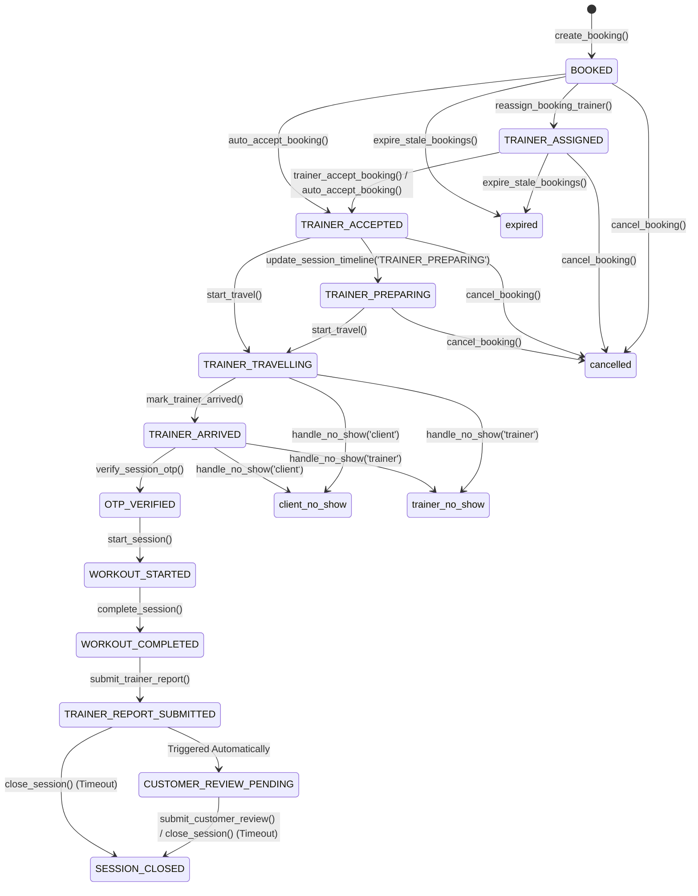

# VIRLA ONE BRAIN: REVISED PHASE 2 TECHNICAL DESIGN & TRANSITION SPECIFICATION
AUTHORITATIVE STATE MACHINE DESIGN — READ-ONLY / PLANNING GATE APPROVED

---

## 1. CANONICAL DATABASE MODEL & TIMESTAMPTZ SCHEMA
To establish Supabase as the single authoritative brain, the database schema will be modified to support actual `timestamptz` instants for all timing decisions. 

### A. New Table DDL & Schema Changes (Planning)
```sql
-- 1. Hardening bookings table schema
ALTER TABLE public.bookings ADD COLUMN IF NOT EXISTS scheduled_start_at timestamptz;
ALTER TABLE public.bookings ADD COLUMN IF NOT EXISTS scheduled_end_at timestamptz;
ALTER TABLE public.bookings ADD COLUMN IF NOT EXISTS request_created_at timestamptz DEFAULT now();
ALTER TABLE public.bookings ADD COLUMN IF NOT EXISTS manual_accepted_at timestamptz;
ALTER TABLE public.bookings ADD COLUMN IF NOT EXISTS auto_accepted_at timestamptz;
ALTER TABLE public.bookings ADD COLUMN IF NOT EXISTS travel_started_at timestamptz;
ALTER TABLE public.bookings ADD COLUMN IF NOT EXISTS trainer_arrived_at timestamptz;
ALTER TABLE public.bookings ADD COLUMN IF NOT EXISTS session_started_at timestamptz;
ALTER TABLE public.bookings ADD COLUMN IF NOT EXISTS session_completed_at timestamptz;
ALTER TABLE public.bookings ADD COLUMN IF NOT EXISTS otp_expires_at timestamptz;

-- 2. Hardening slot_reservations table schema
ALTER TABLE public.slot_reservations ADD COLUMN IF NOT EXISTS scheduled_start_at timestamptz;
ALTER TABLE public.slot_reservations ADD COLUMN IF NOT EXISTS scheduled_end_at timestamptz;
ALTER TABLE public.slot_reservations ADD COLUMN IF NOT EXISTS expires_at timestamptz;
```

### B. Audit Trail Model (`booking_state_events`)
To record every state mutation authoritatively on the server, we will create the following audit trail schema:
```sql
CREATE TABLE IF NOT EXISTS public.booking_state_events (
  id uuid DEFAULT gen_random_uuid() PRIMARY KEY,
  booking_id text NOT NULL REFERENCES public.bookings(id) ON DELETE CASCADE,
  event_type text NOT NULL,
  previous_state text,
  new_state text,
  actor_user_id text,
  actor_role text CHECK (actor_role IN ('customer', 'trainer', 'admin', 'system')),
  server_timestamp timestamptz DEFAULT now() NOT NULL,
  metadata jsonb DEFAULT '{}'::jsonb
);

-- Enable RLS on events table
ALTER TABLE public.booking_state_events ENABLE ROW LEVEL SECURITY;
```

---

## 2. CANONICAL STATE MACHINE
The session lifecycle consists of 12 sequential canonical states and 6 exceptional terminal states. No client can transition states out of order.

### A. Lifecycle Diagram (Mermaid)


---

## 3. COMPLETE TRANSITION MATRIX

For every transition, the server evaluates constraints atomically using database time (`now()`) and auth headers (`auth.uid()`).

### 1. Booking Creation
- **Previous State:** `None / Draft`
- **New State:** `BOOKED`
- **Actor:** Customer (via Client App)
- **Actor Role:** `customer`
- **Server-Time Condition:** `p_scheduled_start_at > now() + interval '30 minutes'` (Booking must be scheduled at least 30 minutes in advance).
- **Prerequisites:**
  - Client profile has balance $\ge 1$ credit (for `SINGLE` sessions) or $\ge 2$ credits (for `COUPLE` sessions).
  - Selected trainer has matching specialty, is online, and verified.
  - Selected trainer has no double-booking overlaps or buffer overlaps (30 minutes travel buffer before/after existing sessions).
- **Database Mutation:**
  - Deduct 1 or 2 credits from `public.user_profiles.credits_balance` where `user_id = auth.uid()`.
  - Insert transaction record in `public.credit_transactions`.
  - Insert booking in `public.bookings` (status = `'upcoming'`, timeline_status = `'BOOKED'`, `request_created_at = now()`, `acceptance_deadline = now() + interval '10 minutes'`).
  - Write event to `public.booking_state_events`.
- **Notification:** Dispatch high-priority push alert to Trainer: "New Booking — Action Required".
- **Admin Visibility:** Marked as `BOOKED` under active queue.
- **Idempotency Rule:** Client sends a unique `booking_id` UUID. Unique constraint on `bookings.id` blocks duplicate inserts; returns success if already created.
- **Failure Response:** Rollback transaction. Throw descriptive SQL exception ("Insufficient Credits", "Trainer overlapping slot").

### 2. Trainer Assignment
- **Previous State:** `BOOKED`
- **New State:** `TRAINER_ASSIGNED`
- **Actor:** System (Match Engine) or Admin
- **Actor Role:** `system` / `admin`
- **Server-Time Condition:** `now() < bookings.created_at + interval '10 minutes'` (within initial SLA).
- **Prerequisites:** Booking exists and matches criteria. Trainer is available.
- **Database Mutation:**
  - Update `bookings.trainer_id = p_assigned_trainer_id` and reset `acceptance_deadline = now() + interval '10 minutes'`.
  - Write event to `booking_state_events`.
- **Notification:** Push alert to newly assigned trainer.
- **Admin Visibility:** Tracked as matching sequence in Admin logs.
- **Idempotency Rule:** Booking row is write-locked. Attempts to assign trainer to the same index are ignored.
- **Failure Response:** Flag matching error, trigger fallback trainer search.

### 3. Trainer Manual Acceptance
- **Previous State:** `BOOKED` or `TRAINER_ASSIGNED`
- **New State:** `TRAINER_ACCEPTED`
- **Actor:** Assigned Trainer
- **Actor Role:** `trainer`
- **Server-Time Condition:** `now() <= bookings.request_created_at + interval '10 minutes'`.
- **Prerequisites:** `timeline_status` is `BOOKED` or `TRAINER_ASSIGNED`. Caller matches `bookings.trainer_id`.
- **Database Mutation:**
  - Update `bookings.timeline_status = 'TRAINER_ACCEPTED'`, `bookings.acceptance_method = 'manual'`, `bookings.manual_accepted_at = now()`.
  - Write event to `booking_state_events`.
- **Notification:** Push alert to Client: "Trainer Assigned".
- **Admin Visibility:** Displayed as manually accepted.
- **Idempotency Rule:** Returns success if status is already `TRAINER_ACCEPTED`.
- **Failure Response:** Raise exception ("Acceptance SLA expired").

### 4. Auto-Acceptance
- **Previous State:** `BOOKED` or `TRAINER_ASSIGNED`
- **New State:** `TRAINER_ACCEPTED`
- **Actor:** System (Database Cron)
- **Actor Role:** `system`
- **Server-Time Condition:** `now() > bookings.request_created_at + interval '10 minutes'`.
- **Prerequisites:** `timeline_status` is `BOOKED` or `TRAINER_ASSIGNED`. Trainer has not manually accepted.
- **Database Mutation:**
  - Update `bookings.timeline_status = 'TRAINER_ACCEPTED'`, `bookings.acceptance_method = 'auto'`, `bookings.auto_accepted_at = now()`, `bookings.notification_count = 3`.
  - Write event to `booking_state_events`.
- **Notification:** Push alert to Client (Sesssion Confirmed), Trainer (Auto-accepted Warning), Admin (Operational Exception alert).
- **Admin Visibility:** Highlighted as **AUTO-ACCEPTED** on live console.
- **Idempotency Rule:** Exits without changes if status is already `TRAINER_ACCEPTED` or cancelled.
- **Failure Response:** Log system warning, alert supervisor.

### 5. Trainer Preparing
- **Previous State:** `TRAINER_ACCEPTED`
- **New State:** `TRAINER_PREPARING`
- **Actor:** Trainer
- **Actor Role:** `trainer`
- **Server-Time Condition:** Any.
- **Prerequisites:** `timeline_status` is `TRAINER_ACCEPTED`. Caller matches trainer.
- **Database Mutation:**
  - Update `bookings.timeline_status = 'TRAINER_PREPARING'`.
  - Write event to `booking_state_events`.
- **Notification:** Push to client: "Coach Preparing".
- **Admin Visibility:** Updates status on console.
- **Idempotency Rule:** Returns success if already `TRAINER_PREPARING`.
- **Failure Response:** Reject transition.

### 6. Start Travel
- **Previous State:** `TRAINER_ACCEPTED` or `TRAINER_PREPARING`
- **New State:** `TRAINER_TRAVELLING`
- **Actor:** Trainer
- **Actor Role:** `trainer`
- **Server-Time Condition:** `now() >= bookings.scheduled_start_at - interval '25 minutes'` AND `now() <= bookings.scheduled_start_at + interval '30 minutes'`.
- **Prerequisites:** Caller matches trainer. Travel window must be open.
- **Database Mutation:**
  - Update `bookings.timeline_status = 'TRAINER_TRAVELLING'`, `bookings.travel_started_at = now()`.
  - Write event to `booking_state_events`.
- **Notification:** Push to Client: "Coach On The Way".
- **Admin Visibility:** Status updates to active travel.
- **Idempotency Rule:** Returns success if already `TRAINER_TRAVELLING`.
- **Failure Response:** Raise exception ("Too early to start travel" or "Session expired").

### 7. Trainer Arrival (Check-in)
- **Previous State:** `TRAINER_TRAVELLING`
- **New State:** `TRAINER_ARRIVED`
- **Actor:** Trainer
- **Actor Role:** `trainer`
- **Server-Time Condition:** `now() >= bookings.scheduled_start_at - interval '30 minutes'` AND `now() <= bookings.scheduled_start_at + interval '30 minutes'`.
- **Prerequisites:** Caller matches trainer.
- **Database Mutation:**
  - Generate cryptographically secure 6-digit OTP on DB server (`to_char(floor(100000 + random() * 900000), 'FM999999')`).
  - Update `bookings.timeline_status = 'TRAINER_ARRIVED'`, `bookings.otp = secure_otp`, `bookings.trainer_arrived_at = now()`, `bookings.otp_expires_at = now() + interval '15 minutes'`.
  - Write event to `booking_state_events`.
- **Notification:** Push to Client containing OTP: "Trainer Arrived".
- **Admin Visibility:** Shows arrived status and countdown timer.
- **Idempotency Rule:** Returns existing OTP and expiry if already checked in.
- **Failure Response:** Reject transition.

### 8. OTP Verification
- **Previous State:** `TRAINER_ARRIVED`
- **New State:** `OTP_VERIFIED`
- **Actor:** Trainer (submitting Client's OTP) or Client
- **Actor Role:** `trainer` / `customer`
- **Server-Time Condition:** `now() <= bookings.otp_expires_at` (within 15-minute grace period) AND `now() <= bookings.scheduled_start_at + interval '30 minutes'`.
- **Prerequisites:** Submitted OTP matches `bookings.otp`.
- **Database Mutation:**
  - Update `bookings.timeline_status = 'OTP_VERIFIED'`.
  - Write event to `booking_state_events`.
- **Notification:** Push status update to both: "OTP Verified".
- **Admin Visibility:** OTP verified.
- **Idempotency Rule:** Returns success if already `OTP_VERIFIED`.
- **Failure Response:** Raise exception ("Invalid OTP" or "OTP Expired").

### 9. Session Start
- **Previous State:** `OTP_VERIFIED`
- **New State:** `WORKOUT_STARTED`
- **Actor:** Trainer
- **Actor Role:** `trainer`
- **Server-Time Condition:** `now() <= bookings.scheduled_start_at + interval '30 minutes'`.
- **Prerequisites:** Timeline is `OTP_VERIFIED`. Caller matches trainer.
- **Database Mutation:**
  - Update `bookings.timeline_status = 'WORKOUT_STARTED'`, `bookings.session_started_at = now()`.
  - Write event to `booking_state_events`.
- **Notification:** Push to Client: "Session Started".
- **Admin Visibility:** Active live session.
- **Idempotency Rule:** Returns success if already `WORKOUT_STARTED`.
- **Failure Response:** Reject transition.

### 10. Session Completion
- **Previous State:** `WORKOUT_STARTED`
- **New State:** `WORKOUT_COMPLETED`
- **Actor:** Trainer
- **Actor Role:** `trainer`
- **Server-Time Condition:** `now() >= bookings.session_started_at + interval '30 minutes'` (safety buffer to prevent instant completion).
- **Prerequisites:** Caller matches trainer.
- **Database Mutation:**
  - Update `bookings.timeline_status = 'WORKOUT_COMPLETED'`, `bookings.status = 'completed'`, `bookings.session_completed_at = now()`.
  - Write event to `booking_state_events`.
- **Notification:** Push rating prompt to Client.
- **Admin Visibility:** Session completed.
- **Idempotency Rule:** Returns success if already completed.
- **Failure Response:** Reject transition.

### 11. Report Submission
- **Previous State:** `WORKOUT_COMPLETED`
- **New State:** `TRAINER_REPORT_SUBMITTED` (triggers `CUSTOMER_REVIEW_PENDING`)
- **Actor:** Trainer
- **Actor Role:** `trainer`
- **Server-Time Condition:** Any.
- **Prerequisites:** Caller matches trainer. Status is completed.
- **Database Mutation:**
  - Update `bookings.timeline_status = 'TRAINER_REPORT_SUBMITTED'`, `bookings.questionnaire = p_questionnaire`.
  - Atomically credit trainer earnings (₹800) to `public.trainer_earnings`.
  - Insert entry to `public.calorie_logs` for client.
  - Write event to `booking_state_events`.
- **Notification:** Push to Client: "Report Submitted".
- **Admin Visibility:** Questionnaire report details visible on Admin.
- **Idempotency Rule:** Questionnaire can only be submitted once. Duplicate calls throw validation error.
- **Failure Response:** Rollback transaction, throw error.

### 12. Review Submission
- **Previous State:** `TRAINER_REPORT_SUBMITTED` or `CUSTOMER_REVIEW_PENDING`
- **New State:** `SESSION_CLOSED`
- **Actor:** Client
- **Actor Role:** `customer`
- **Server-Time Condition:** Any.
- **Prerequisites:** Caller matches client.
- **Database Mutation:**
  - Update `bookings.timeline_status = 'SESSION_CLOSED'`, `bookings.rating_details = p_rating_details`.
  - Re-calculate trainer's aggregate rating average and count in `public.trainers`.
  - Write event to `booking_state_events`.
- **Notification:** None.
- **Admin Visibility:** Review ratings stored.
- **Idempotency Rule:** Rejects updates if review already exists.
- **Failure Response:** Throw rating validation error.

### 13. Customer Cancellation (Early)
- **Previous State:** `BOOKED`, `TRAINER_ASSIGNED`, `TRAINER_ACCEPTED`, `TRAINER_PREPARING`
- **New State:** `cancelled` (terminal state, timeline set to `SESSION_CLOSED`)
- **Actor:** Client
- **Actor Role:** `customer`
- **Server-Time Condition:** `now() < bookings.scheduled_start_at - interval '25 minutes'` (Must occur before the travel window opens).
- **Prerequisites:** Booking is upcoming. Caller matches client.
- **Database Mutation:**
  - Update `bookings.status = 'cancelled'`, `bookings.timeline_status = 'SESSION_CLOSED'`.
  - Refund credits to `public.user_profiles.credits_balance` (+1 or +2 based on Single/Couple workout).
  - Insert credit refund ledger transaction in `public.credit_transactions`.
  - Write event to `booking_state_events`.
- **Notification:** Push cancellation alerts to trainer and client.
- **Admin Visibility:** Marked as early cancelled.
- **Idempotency Rule:** Checked via atomic status query; prevents double refunds.
- **Failure Response:** Raise exception ("Cannot perform early cancellation, travel window has opened").

### 14. Customer No-Show (Late Cancellation Penalty)
- **Previous State:** `TRAINER_TRAVELLING` or `TRAINER_ARRIVED`
- **New State:** `client_no_show` (terminal state, timeline set to `SESSION_CLOSED`)
- **Actor:** Trainer (declaring no-show after grace expiry) or System (Cron)
- **Actor Role:** `trainer` / `system`
- **Server-Time Condition:** `now() > bookings.otp_expires_at` (grace period expired).
- **Prerequisites:** Booking is upcoming. Timeline status is arrived/travelling.
- **Database Mutation:**
  - Update `bookings.status = 'client_no_show'`, `bookings.timeline_status = 'SESSION_CLOSED'`.
  - Credits forfeited (no refund).
  - Atomically credit ₹400 travel compensation to `public.trainer_earnings` for the trainer.
  - Write event to `booking_state_events`.
- **Notification:** Push alerts to both: "Credits forfeited due to client no-show".
- **Admin Visibility:** Flags as client no-show exception.
- **Idempotency Rule:** Exits if already closed, preventing duplicate compensation updates.
- **Failure Response:** Reject penalty declaration.

### 15. Trainer No-Show
- **Previous State:** `BOOKED`, `TRAINER_ASSIGNED`, `TRAINER_ACCEPTED`, `TRAINER_PREPARING`, `TRAINER_TRAVELLING`, `TRAINER_ARRIVED`
- **New State:** `trainer_no_show` (terminal state, timeline set to `SESSION_CLOSED`)
- **Actor:** Client (declaring coach no-show) or System (Cron)
- **Actor Role:** `customer` / `system`
- **Server-Time Condition:** `now() > bookings.scheduled_start_at + interval '30 minutes'` (Session not started 30 mins after scheduled time).
- **Prerequisites:** Session is unverified and unstarted.
- **Database Mutation:**
  - Update `bookings.status = 'trainer_no_show'`, `bookings.timeline_status = 'SESSION_CLOSED'`.
  - Refund original credits + 1 bonus credit (+2 credits total for Single, +3 for Couple) to client's profile.
  - Insert transaction compensation to `credit_transactions`.
  - Insert -₹500 penalty charge in `public.trainer_earnings` for the trainer.
  - Write event to `booking_state_events`.
- **Notification:** Push refund confirmation to Client, penalty notification to Trainer.
- **Admin Visibility:** Trainer penalized; flagged.
- **Idempotency Rule:** Exits if already closed, preventing duplicate compensation/penalties.
- **Failure Response:** Throw error.

### 16. Expiry / Missed
- **Previous State:** Any unstarted state.
- **New State:** `expired` (terminal state, timeline set to `SESSION_CLOSED`)
- **Actor:** System (Cron)
- **Actor Role:** `system`
- **Server-Time Condition:** `now() > bookings.scheduled_start_at + interval '30 minutes'`.
- **Prerequisites:** Session never verified or checked in.
- **Database Mutation:**
  - Update `bookings.status = 'missed_session_not_started'`, `bookings.timeline_status = 'SESSION_CLOSED'`.
  - Credits forfeited.
  - Write event to `booking_state_events`.
- **Notification:** Push missed session notifications.
- **Admin Visibility:** Archived as expired.
- **Idempotency Rule:** Safe single-pass execution.
- **Failure Response:** Log warning.

---

## 4. AUTHORITATIVE RPC SPECIFICATION

Every RPC evaluates state, auth, and timing bounds atomically. All execution routes occur within a transaction (`BEGIN/COMMIT`).

### A. `create_booking`
```sql
CREATE OR REPLACE FUNCTION public.create_booking(
  p_booking_id text,
  p_workout_id text,
  p_scheduled_start_at timestamptz,
  p_scheduled_end_at timestamptz,
  p_assigned_trainer_id text
) RETURNS jsonb
LANGUAGE plpgsql SECURITY DEFINER AS $$
DECLARE
  v_client_id text;
  v_session_type text;
  v_credit_cost integer;
  v_current_credits integer;
  v_workout_title text;
  v_workout_price integer;
  v_trainer_name text;
  v_client_name text;
  v_client_phone text;
BEGIN
  -- 1. Authentication
  v_client_id := auth.uid();
  IF v_client_id IS NULL THEN
    RAISE EXCEPTION 'Unauthorized';
  END IF;

  -- 2. Prevent Double booking of Trainer (Buffer check - 30 mins)
  IF EXISTS (
    SELECT 1 FROM public.bookings
    WHERE trainer_id = p_assigned_trainer_id
      AND status = 'upcoming'
      AND (
        (scheduled_start_at - interval '30 minutes', scheduled_end_at + interval '30 minutes') OVERLAPS 
        (p_scheduled_start_at, p_scheduled_end_at)
      )
  ) THEN
    RAISE EXCEPTION 'Trainer is unavailable due to an overlapping booking or travel buffer conflict.';
  END IF;

  -- 3. Determine Workout Cost (Single = 1 credit, Couple = 2 credits)
  SELECT category, title, session_price INTO v_session_type, v_workout_title, v_workout_price 
  FROM public.workouts WHERE id = p_workout_id;
  
  IF v_session_type = 'COUPLE' THEN
    v_credit_cost := 2;
  ELSE
    v_credit_cost := 1;
  END IF;

  -- 4. Check Credits Balance
  SELECT credits_balance, name, phone INTO v_current_credits, v_client_name, v_client_phone
  FROM public.user_profiles
  JOIN public.users ON users.id = user_profiles.user_id
  WHERE user_profiles.user_id = v_client_id;

  IF v_current_credits < v_credit_cost THEN
    RAISE EXCEPTION 'Insufficient credits balance. Required: %, Available: %', v_credit_cost, v_current_credits;
  END IF;

  SELECT name INTO v_trainer_name FROM public.trainers WHERE id = p_assigned_trainer_id;

  -- 5. Atomic Mutations
  UPDATE public.user_profiles 
  SET credits_balance = credits_balance - v_credit_cost 
  WHERE user_id = v_client_id;

  INSERT INTO public.credit_transactions (id, user_id, type, amount, date, status, credits)
  VALUES (
    'tx-' || EXTRACT(epoch FROM now())::bigint || '-' || floor(random()*1000)::text,
    v_client_id,
    'spend',
    '₹0',
    to_char(now(), 'Mon DD, YYYY'),
    'paid',
    v_credit_cost
  );

  INSERT INTO public.bookings (
    id, status, timeline_status, otp, client_name, client_phone, trainer_name,
    scheduled_start_at, scheduled_end_at, workout_title, price, client_id, trainer_id,
    request_created_at, acceptance_notification_count, last_acceptance_notification_at, acceptance_deadline
  ) VALUES (
    p_booking_id,
    'upcoming',
    'BOOKED',
    to_char(floor(1000 + random() * 9000), 'FM9999'),
    v_client_name,
    v_client_phone,
    v_trainer_name,
    p_scheduled_start_at,
    p_scheduled_end_at,
    v_workout_title,
    coalesce(v_workout_price, 1200),
    v_client_id,
    p_assigned_trainer_id,
    now(),
    1,
    (EXTRACT(epoch FROM now())*1000)::bigint,
    (EXTRACT(epoch FROM now() + interval '10 minutes')*1000)::bigint
  );

  INSERT INTO public.booking_state_events (booking_id, event_type, previous_state, new_state, actor_user_id, actor_role)
  VALUES (p_booking_id, 'BOOKING_CREATED', NULL, 'BOOKED', v_client_id, 'customer');

  RETURN jsonb_build_object('success', true, 'booking_id', p_booking_id);
END;
$$;
```

### B. `start_travel`
```sql
CREATE OR REPLACE FUNCTION public.start_travel(
  p_booking_id text
) RETURNS jsonb
LANGUAGE plpgsql SECURITY DEFINER AS $$
DECLARE
  v_trainer_id text;
  v_booking record;
BEGIN
  v_trainer_id := auth.uid();
  IF v_trainer_id IS NULL THEN
    RAISE EXCEPTION 'Unauthorized';
  END IF;

  SELECT * INTO v_booking FROM public.bookings WHERE id = p_booking_id FOR UPDATE;
  IF NOT FOUND THEN
    RAISE EXCEPTION 'Booking not found';
  END IF;

  IF v_booking.trainer_id != v_trainer_id THEN
    RAISE EXCEPTION 'Access denied';
  END IF;

  IF v_booking.timeline_status = 'TRAINER_TRAVELLING' THEN
    RETURN jsonb_build_object('success', true);
  END IF;

  -- TRAVEL WINDOW CHECK: Opens exactly 25 minutes prior to scheduled start time
  IF now() < v_booking.scheduled_start_at - interval '25 minutes' THEN
    RAISE EXCEPTION 'Too early to start travel. Window opens exactly 25 minutes before scheduled session time.';
  END IF;
  
  IF now() > v_booking.scheduled_start_at + interval '30 minutes' THEN
     RAISE EXCEPTION 'Session expired. Travel window has closed.';
  END IF;

  UPDATE public.bookings 
  SET timeline_status = 'TRAINER_TRAVELLING', travel_started_at = now()
  WHERE id = p_booking_id;

  INSERT INTO public.booking_state_events (booking_id, event_type, previous_state, new_state, actor_user_id, actor_role)
  VALUES (p_booking_id, 'TRAVEL_STARTED', v_booking.timeline_status, 'TRAINER_TRAVELLING', v_trainer_id, 'trainer');

  RETURN jsonb_build_object('success', true);
END;
$$;
```

### C. `mark_trainer_arrived`
```sql
CREATE OR REPLACE FUNCTION public.mark_trainer_arrived(
  p_booking_id text
) RETURNS jsonb
LANGUAGE plpgsql SECURITY DEFINER AS $$
DECLARE
  v_trainer_id text;
  v_booking record;
  v_otp text;
BEGIN
  v_trainer_id := auth.uid();
  IF v_trainer_id IS NULL THEN
    RAISE EXCEPTION 'Unauthorized';
  END IF;

  SELECT * INTO v_booking FROM public.bookings WHERE id = p_booking_id FOR UPDATE;
  IF NOT FOUND THEN
    RAISE EXCEPTION 'Booking not found';
  END IF;

  IF v_booking.trainer_id != v_trainer_id THEN
     RAISE EXCEPTION 'Access denied';
  END IF;

  -- Idempotency check
  IF v_booking.timeline_status = 'TRAINER_ARRIVED' THEN
     RETURN jsonb_build_object('success', true, 'otp_expires_at', v_booking.otp_expires_at);
  END IF;

  IF v_booking.timeline_status != 'TRAINER_TRAVELLING' THEN
    RAISE EXCEPTION 'Cannot mark arrived unless currently travelling';
  END IF;

  -- Generate OTP authoritatively on server
  v_otp := to_char(floor(100000 + random() * 900000), 'FM999999');

  UPDATE public.bookings
  SET timeline_status = 'TRAINER_ARRIVED',
      otp = v_otp,
      trainer_arrived_at = now(),
      otp_expires_at = now() + interval '15 minutes'
  WHERE id = p_booking_id;

  INSERT INTO public.booking_state_events (booking_id, event_type, previous_state, new_state, actor_user_id, actor_role)
  VALUES (p_booking_id, 'TRAINER_ARRIVED', 'TRAINER_TRAVELLING', 'TRAINER_ARRIVED', v_trainer_id, 'trainer');

  RETURN jsonb_build_object('success', true, 'otp_expires_at', now() + interval '15 minutes');
END;
$$;
```

### D. `verify_session_otp`
```sql
CREATE OR REPLACE FUNCTION public.verify_session_otp(
  p_booking_id text,
  p_entered_otp text
) RETURNS jsonb
LANGUAGE plpgsql SECURITY DEFINER AS $$
DECLARE
  v_caller_id text;
  v_booking record;
BEGIN
  v_caller_id := auth.uid();
  IF v_caller_id IS NULL THEN
     RAISE EXCEPTION 'Unauthorized';
  END IF;

  SELECT * INTO v_booking FROM public.bookings WHERE id = p_booking_id FOR UPDATE;
  IF NOT FOUND THEN
    RAISE EXCEPTION 'Booking not found';
  END IF;

  IF v_booking.timeline_status = 'OTP_VERIFIED' THEN
    RETURN jsonb_build_object('success', true);
  END IF;

  IF v_booking.timeline_status != 'TRAINER_ARRIVED' THEN
    RAISE EXCEPTION 'Trainer must check in before verifying OTP';
  END IF;

  -- Expiry Check
  IF now() > v_booking.otp_expires_at THEN
     RAISE EXCEPTION 'OTP has expired. Grace period is over.';
  END IF;

  -- Validate OTP
  IF v_booking.otp != p_entered_otp THEN
     RAISE EXCEPTION 'Invalid OTP. Please check and try again.';
  END IF;

  UPDATE public.bookings
  SET timeline_status = 'OTP_VERIFIED'
  WHERE id = p_booking_id;

  INSERT INTO public.booking_state_events (booking_id, event_type, previous_state, new_state, actor_user_id, actor_role)
  VALUES (p_booking_id, 'OTP_VERIFIED', 'TRAINER_ARRIVED', 'OTP_VERIFIED', v_caller_id, 
          CASE WHEN v_caller_id = v_booking.client_id THEN 'customer'::text ELSE 'trainer'::text END);

  RETURN jsonb_build_object('success', true);
END;
$$;
```

### E. `cancel_booking`
```sql
CREATE OR REPLACE FUNCTION public.cancel_booking(
  p_booking_id text
) RETURNS jsonb
LANGUAGE plpgsql SECURITY DEFINER AS $$
DECLARE
  v_caller_id text;
  v_booking record;
  v_refund_amount integer;
BEGIN
  v_caller_id := auth.uid();
  IF v_caller_id IS NULL THEN
     RAISE EXCEPTION 'Unauthorized';
  END IF;

  SELECT * INTO v_booking FROM public.bookings WHERE id = p_booking_id FOR UPDATE;
  IF NOT FOUND THEN
    RAISE EXCEPTION 'Booking not found';
  END IF;

  IF v_booking.client_id != v_caller_id AND NOT public.is_admin(v_caller_id) THEN
     RAISE EXCEPTION 'Access denied';
  END IF;

  IF v_booking.status = 'cancelled' THEN
     RETURN jsonb_build_object('success', true);
  END IF;

  IF v_booking.status != 'upcoming' THEN
    RAISE EXCEPTION 'Cannot cancel booking in status %', v_booking.status;
  END IF;

  -- EVALUATE LATE CANCELLATION: Based strictly on scheduled_start_at minus 25 minutes (travel window opening)
  IF now() >= v_booking.scheduled_start_at - interval '25 minutes' THEN
     -- LATE CANCEL PENALTY: Deduct credits (no refund)
     UPDATE public.bookings 
     SET status = 'cancelled', timeline_status = 'SESSION_CLOSED'
     WHERE id = p_booking_id;

     -- Earning for Trainer as Compensation (₹400)
     INSERT INTO public.trainer_earnings (id, trainer_id, booking_id, client_name, amount, date, type)
     VALUES (
       'earn-' || EXTRACT(epoch FROM now())::bigint || '-' || floor(random()*1000)::text,
       v_booking.trainer_id,
       p_booking_id,
       v_booking.client_name || ' (Late Cancel)',
       400,
       to_char(now(), 'Mon DD, YYYY'),
       'no_show_compensation'
     );

     INSERT INTO public.booking_state_events (booking_id, event_type, previous_state, new_state, actor_user_id, actor_role, metadata)
     VALUES (p_booking_id, 'LATE_CANCELLATION', v_booking.timeline_status, 'SESSION_CLOSED', v_caller_id, 'customer', '{"penalty": true}'::jsonb);

     RETURN jsonb_build_object('success', true, 'late', true);
  ELSE
     -- EARLY CANCEL: Full Refund
     IF EXISTS (SELECT 1 FROM public.workouts WHERE title = v_booking.workout_title AND category = 'COUPLE') THEN
       v_refund_amount := 2;
     ELSE
       v_refund_amount := 1;
     END IF;

     UPDATE public.user_profiles 
     SET credits_balance = credits_balance + v_refund_amount
     WHERE user_id = v_booking.client_id;

     INSERT INTO public.credit_transactions (id, user_id, type, amount, date, status, credits)
     VALUES (
       'tx-' || EXTRACT(epoch FROM now())::bigint || '-' || floor(random()*1000)::text,
       v_booking.client_id,
       'refund',
       '₹0',
       to_char(now(), 'Mon DD, YYYY'),
       'paid',
       v_refund_amount
     );

     UPDATE public.bookings 
     SET status = 'cancelled', timeline_status = 'SESSION_CLOSED'
     WHERE id = p_booking_id;

     INSERT INTO public.booking_state_events (booking_id, event_type, previous_state, new_state, actor_user_id, actor_role, metadata)
     VALUES (p_booking_id, 'EARLY_CANCELLATION', v_booking.timeline_status, 'SESSION_CLOSED', v_caller_id, 'customer', '{"refunded": true}'::jsonb);

     RETURN jsonb_build_object('success', true, 'late', false);
  END IF;
END;
$$;
```

---

## 5. RLS POLICY PLAN
To block client-direct updates to timing, status, and credit columns, the raw RLS policies will be tightened:

### A. `user_profiles` RLS
```sql
DROP POLICY IF EXISTS "Enable UPDATE for self or admin" ON public.user_profiles;
CREATE POLICY "Enable SELECT/INSERT for owner or admin" ON public.user_profiles
  FOR ALL USING (user_id = auth.uid() OR public.is_admin(auth.uid()));

-- Tightened UPDATE policy: user can update general profile data but CANNOT modify credits_balance
CREATE POLICY "Enable UPDATE profile details except credits" ON public.user_profiles
  FOR UPDATE USING (user_id = auth.uid() OR public.is_admin(auth.uid()))
  WITH CHECK (
    (user_id = auth.uid() AND (credits_balance IS NOT DISTINCT FROM (SELECT credits_balance FROM public.user_profiles WHERE user_id = auth.uid())))
    OR public.is_admin(auth.uid())
  );
```

### B. `bookings` RLS
```sql
DROP POLICY IF EXISTS "Enable UPDATE for participant" ON public.bookings;
-- Clients can ONLY update text notes (e.g., trainer_note, address); state transition changes require RPCs
CREATE POLICY "Restrict bookings updates to non-timeline fields" ON public.bookings
  FOR UPDATE USING (client_id = auth.uid() OR trainer_id = auth.uid() OR public.is_admin(auth.uid()))
  WITH CHECK (
    (
      status IS NOT DISTINCT FROM (SELECT status FROM public.bookings WHERE id = bookings.id) AND
      timeline_status IS NOT DISTINCT FROM (SELECT timeline_status FROM public.bookings WHERE id = bookings.id) AND
      scheduled_start_at IS NOT DISTINCT FROM (SELECT scheduled_start_at FROM public.bookings WHERE id = bookings.id) AND
      otp IS NOT DISTINCT FROM (SELECT otp FROM public.bookings WHERE id = bookings.id)
    )
    OR public.is_admin(auth.uid())
  );
```

---

## 6. TIMESTAMPTZ MIGRATION & BACKFILL STRATEGY
To convert existing records without losing historic data, we will deploy a safe migration process.

### A. DDL Migration Script
```sql
-- Step 1: Add timestamptz columns
ALTER TABLE public.bookings ADD COLUMN IF NOT EXISTS scheduled_start_at timestamptz;
ALTER TABLE public.bookings ADD COLUMN IF NOT EXISTS scheduled_end_at timestamptz;
```

### B. Backfill Query
This function uses the existing text parser safely to convert historical booking slots to actual UTC instansts:
```sql
-- Step 2: Safe backfill execution
UPDATE public.bookings
SET 
  scheduled_start_at = public.parse_booking_start_time(date, time),
  scheduled_end_at = public.parse_booking_start_time(date, time) + (coalesce(duration_minutes, 60) * interval '1 minute')
WHERE scheduled_start_at IS NULL AND date IS NOT NULL AND time IS NOT NULL;
```

---

## 7. AUDIT & NOTIFICATION ARCHITECTURE
Push notifications are decoupled from application logic. They are fired directly by database event triggers logging to `public.notifications` or matching events in `booking_state_events`.

### A. Notification Dispatch Trigger on Audit Log Insertion
```sql
CREATE OR REPLACE FUNCTION public.dispatch_audit_notification() RETURNS trigger AS $$
DECLARE
  v_client_id text;
  v_trainer_id text;
  v_workout_title text;
  v_title text;
  v_body text;
  v_deep_link text;
  v_recipient_id text;
BEGIN
  SELECT client_id, trainer_id, workout_title INTO v_client_id, v_trainer_id, v_workout_title
  FROM public.bookings WHERE id = NEW.booking_id;

  IF NEW.event_type = 'BOOKING_CREATED' THEN
    v_recipient_id := v_trainer_id;
    v_title := 'New Booking Request 🔔';
    v_body := 'New session request for ' || v_workout_title || '.';
    v_deep_link := '/session-detail?id=' || NEW.booking_id;
  ELSIF NEW.event_type = 'TRAVEL_STARTED' THEN
    v_recipient_id := v_client_id;
    v_title := 'Coach On The Way 🚗';
    v_body := 'Your trainer has started travelling to your venue.';
    v_deep_link := '/session-detail?id=' || NEW.booking_id;
  END IF;

  IF v_recipient_id IS NOT NULL THEN
    INSERT INTO public.notifications (id, user_id, title, body, read, timestamp, "group", icon)
    VALUES (
      'notify-' || EXTRACT(epoch FROM now())::bigint || '-' || floor(random()*1000)::text,
      v_recipient_id,
      v_title,
      jsonb_build_object('body', v_body, 'deepLink', v_deep_link, 'is_meta', true)::text,
      false,
      'Just now',
      'today',
      'bell'
    );
  END IF;
  RETURN NEW;
END;
$$ LANGUAGE plpgsql;
```

---

## 8. CLIENT-TO-RPC MIGRATION MAP
The client Zustand stores are updated to serve as presentation layers.

```
+------------------------------------+      RPC      +---------------------------------+
|        Zustand Client Cache        |  ==========>  |      Authoritative Supabase     |
| (useBookingStore/useWalletStore)   |  <==========  | (SECURITY DEFINER / real-time)  |
+------------------------------------+    Realtime   +---------------------------------+
```

- **Booking Creation:**
  - *Old Code:* `Database.addBooking` and `profile.creditsBalance -= 1`
  - *New Code:* Call `supabase.rpc('create_booking', { p_booking_id, p_workout_id, p_scheduled_start_at, p_scheduled_end_at, p_assigned_trainer_id })`.
- **Trainer Acceptance:**
  - *Old Code:* `bookingStore.acceptBooking` -> updates timeline to `'trainer_accepted'` directly in table.
  - *New Code:* Call `supabase.rpc('trainer_accept_booking', { p_booking_id })`.
- **Check-in & OTP Generation:**
  - *Old Code:* `SessionEngine.checkIn` -> generates OTP client-side and updates DB.
  - *New Code:* Call `supabase.rpc('trainer_check_in', { p_booking_id })` -> retrieves generated OTP from return payload.
- **Verification:**
  - *Old Code:* `SessionEngine.verifyOTP` -> checks matches and implements local offline fallback.
  - *New Code:* Call `supabase.rpc('verify_session_otp', { p_booking_id, p_entered_otp })` -> strict online verification.

---

## 9. ROLLBACK STRATEGY
If migration issues arise, the rollback script will:
1. Re-enable client updates for `bookings` and `user_profiles` RLS.
2. Drop new policies and restore previous policies using baseline migration commits.
3. Keep the new `scheduled_start_at` / `scheduled_end_at` fields but return text date parsing to the client.

---

## 10. AUTOMATED TEST MATRIX

| Test ID | Area | Scenario | Input / Action | Expected Server Outcome |
| :--- | :--- | :--- | :--- | :--- |
| **TC-01** | Booking | Attempt creation with 0 credits | Call `create_booking()` | Rollback. SQL Exception: Insufficient credits. |
| **TC-02** | Booking | Attempt double booking of trainer | Overlapping `scheduled_start_at` | Rollback. SQL Exception: Trainer unavailable. |
| **TC-03** | Booking | Attempt booking within 30-min buffer | Overlapping buffer margin | Rollback. SQL Exception: Travel buffer conflict. |
| **TC-04** | Credits | Atomic deduction: Single Session | Call `create_booking()` for Single | Deducts exactly 1 credit; transaction log inserted. |
| **TC-05** | Credits | Atomic deduction: Couple Session | Call `create_booking()` for Couple | Deducts exactly 2 credits; transaction log inserted. |
| **TC-06** | Acceptance | Acceptance after 10-minute SLA | Call `trainer_accept_booking()` | SLA Check: Rejected. SQL Exception: SLA expired. |
| **TC-07** | Travel | Travel start before 25-minute window | Call `start_travel()` at T-26m | Validation: Rejected. SQL Exception: Too early. |
| **TC-08** | Travel | Travel start at exactly 25 mins | Call `start_travel()` at T-25m | Validation: Allowed. Status = `TRAINER_TRAVELLING`. |
| **TC-09** | Travel | Travel start after travel window | Call `start_travel()` at T-10m | Validation: Allowed. Status = `TRAINER_TRAVELLING`. |
| **TC-10** | Arrival | Arrival check-in OTP generation | Call `trainer_check_in()` | Status = `TRAINER_ARRIVED`. Server generates OTP. |
| **TC-11** | OTP | Verify OTP within 15-minute grace | Call `verify_session_otp()` | Status = `OTP_VERIFIED`. |
| **TC-12** | OTP | Verify OTP after 15-minute grace | Call `verify_session_otp()` | Rejected. Exception: OTP has expired. |
| **TC-13** | OTP | Replay validation on OTP | Multiple retries | Blocked. Idempotency returns current status. |
| **TC-14** | Cancellation| Early cancellation credits refund | Call `cancel_booking()` at T-1h | Status = `cancelled`. Client refunded (1 or 2). |
| **TC-15** | Cancellation| Late cancellation credits forfeit | Call `cancel_booking()` at T-10m | Status = `cancelled`. Forfeited. Trainer earns ₹400. |
| **TC-16** | No-Show | Trainer no-show penalty check | System Cron at T+30m | Status = `trainer_no_show`. Refund + bonus to client. |
| **TC-17** | Timing | Boundary midnight transition check | Schedule at 11:59 PM | Overlap query evaluates correctly across day shifts. |
